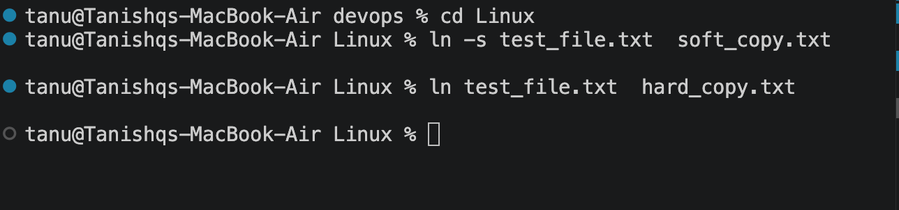

In Linux, soft links (also known as symbolic links or symlinks) and hard links are two different ways to create references or shortcuts to existing files. The core difference lies in how they point to the underlying data on your storage drive




What is the fundamental difference between a soft link and a hard link?
Answer snippet: A soft link points to the path of the original file (like a shortcut), while a hard link points directly to the inode of the original file (acting as an exact alias).What happens to a soft link and a hard link if the original file is deleted?Answer snippet: The soft link breaks and becomes a dangling link because its target path no longer exists. The hard link still works and can access the data perfectly fine, because the underlying data is only deleted when all hard links pointing to that inode are gone.

## Task 2: `adduser` vs `useradd`

### Difference between `adduser` and `useradd`

- `useradd` is a low-level command that creates a user account. It usually requires additional options to configure the home directory, shell, and other settings.
- `adduser` is a higher-level, interactive script available on Ubuntu and Debian. It guides the administrator through creating the user, home directory, password, and optional user details.

### Preferred command on Ubuntu/Linux

`adduser` is generally preferred for manually creating users on Ubuntu because it is more user-friendly and applies sensible defaults. `useradd` is useful for scripts and automation because it is more direct and predictable when all options are specified explicitly.

### Create a test user

Run the following command with administrator privileges:

```bash
sudo adduser testuser
```

Follow the prompts to set a password and user information. Verify the user was created with:

```bash
id testuser
```

## Task 3: `journalctl`

### What is `journalctl` used for?

`journalctl` is used to view and search logs collected by `systemd-journald`. It can display system messages, boot logs, errors, and logs produced by individual services.

### View system logs

```bash
journalctl
journalctl -n 50
sudo journalctl -f
journalctl -b
```

### Check logs for a specific service

Replace `service-name` with the name of the service you want to inspect:

```bash
sudo journalctl -u service-name
sudo journalctl -u service-name -n 50
```

For example, to view SSH service logs:

```bash
sudo journalctl -u ssh
```

## Task 4: Linux Command Cheat Sheet

Review and practice these important Linux commands:

| Command | Purpose | Example |
|---|---|---|
| `pwd` | Display the current directory | `pwd` |
| `ls` | List files and directories | `ls -la` |
| `cd` | Change directory | `cd Linux` |
| `mkdir` | Create a directory | `mkdir practice` |
| `touch` | Create an empty file | `touch notes.txt` |
| `cp` | Copy files or directories | `cp notes.txt backup.txt` |
| `mv` | Move or rename files | `mv backup.txt old-notes.txt` |
| `rm` | Remove files | `rm old-notes.txt` |
| `cat` | Display file contents | `cat notes.txt` |
| `less` | Read a file page by page | `less notes.txt` |
| `grep` | Search for text | `grep "Linux" notes.txt` |
| `find` | Search for files | `find . -name "*.txt"` |
| `chmod` | Change permissions | `chmod u+x script.sh` |
| `ln` | Create links | `ln -s notes.txt notes-link.txt` |
| `man` | Open command documentation | `man ls` |
| `sudo` | Run a command with administrator privileges | `sudo adduser testuser` |

Practice the commands in a temporary directory:

```bash
mkdir ~/linux-practice
cd ~/linux-practice
touch notes.txt
echo "Linux practice" > notes.txt
cat notes.txt
cp notes.txt copy.txt
mv copy.txt renamed-copy.txt
find . -name "*.txt"
rm renamed-copy.txt notes.txt
cd ..
rmdir ~/linux-practice
```